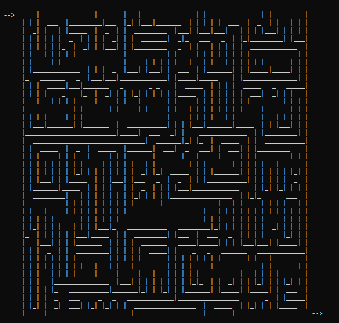

# ASCII Maze
A command line program that lets you create random mazes. The mazes are text based, and only made with ASCII characters. They can be scaled to whatever size you want, and saved to a file, if you add the argument "-file". I came up with the algorithm myself. It may take a while to create depending on the size.



## How to Run

Example - this will print to maze to your terminal:
```
java -jar ASCII-Maze.jar -w 40 -h 20
```
Example - this will export it to a file called "my_maze.txt":
```
java -jar ASCII-Maze.jar -w 40 -h 20 -file my_maze.txt
```
## License

This project is licensed under the MIT License - see the [LICENSE](LICENSE) file for details